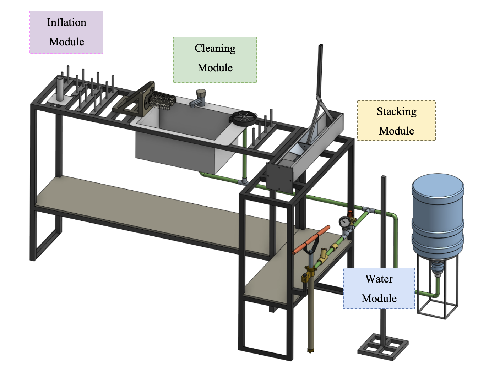
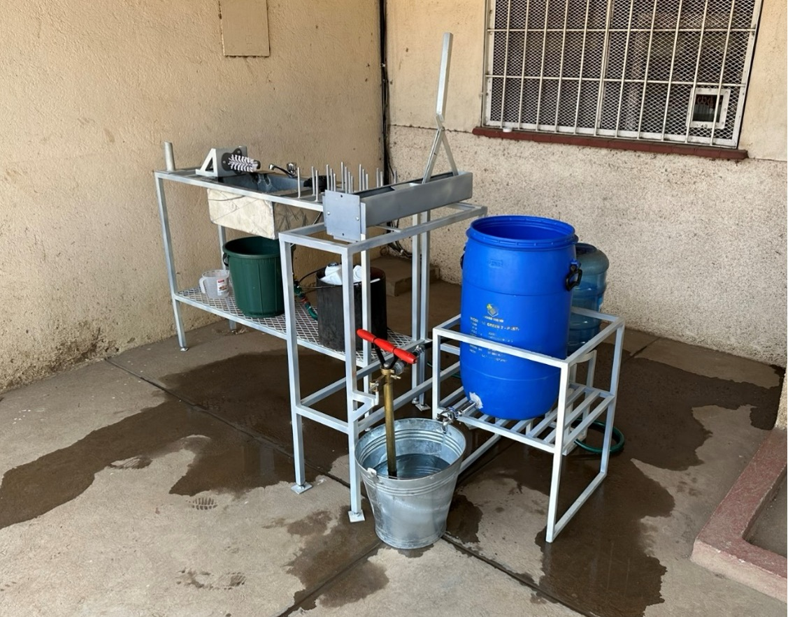
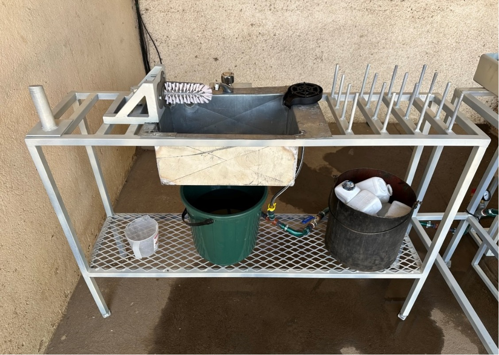

 

 

<h1> Technical Documentation: Design of an HDPE bottle collection and pre-cleaning system for recycling in Blantyre, Malawi </h1>

<h2>Author: Timo Stutz    Supervisors: Prof. Dr. Elizabeth Tilley, Dr. Jakub Tkaczuk, Lin Boynton   </h2>

<h1>Table of Contents </h1>

1. [Introduction](#1.-introduction)
2. Prototype Overview
3. Part List
4. User Manual
	1. Prototype Construction
	2. Prototype Operation
	3. Maintenance
	4. Safety Precautions

# 1. Introduction

This technical documentation presents an overview of a prototype for an HDPE bottle pre-cleaning station, developed as a sustainable solution to enhance recycling processes in low-resource settings. The prototype was developed within the master’s thesis of Timo Stutz, contributing to a PhD project conducted by Lin Boynton at the Chair of Global Health Engineering at ETH Zurich. The PhD research aims to design, implement, and evaluate a closed-loop plastic bottle recycling scheme in low-income countries to efficiently, and effectively manage the flow of waste bottles from consumers into new drinking bottles. The prototype addresses the challenges of recycling contaminated HDPE bottles by introducing an efficient, scalable, and locally adaptable pre-cleaning system aiming to reduce the efforts and costs of subsequent recycling processes. Designed and tested through a collaborative research project, this documentation summarizes the prototype's design, constructional and operational procedures, maintenance of the device, and safety recommendations.

The underlying master’s thesis is openly accessible on the ETH Zurich research collection and can be found here: [https://www.research-collection.ethz.ch/handle/20.500.11850/658745](https://www.research-collection.ethz.ch/handle/20.500.11850/658745)

# 2. Prototype Overview

The pre-cleaning station was mainly developed to address cleanliness requirements of collected HDPE bottles before they undergo recycling. This prototype is segmented into distinct modules, each designed to fulfill a specific function in the pre-cleaning process. Figure 1 shows the CAD drawing of the complete prototype and its different modules. In Figure 2, the complete assembly of the physical prototype is depicted. Finally, Figure 3 shows a focussed view on the inflation and cleaning interface. Below is a summary of each module and its function within the prototype:

1. **Inflation Module:** This module is responsible for restoring crushed or deformed bottles to their original shape, making them easier to clean and process. By applying controlled pressure, the inflation module ensures that bottles regain a uniform shape for efficient cleaning.

2. **Cleaning Module:** Equipped with mechanisms for both internal and external cleaning, this module utilizes water jets and brushes to remove organic contaminants from the bottles

3. **Water Module:** This module provides the necessary water supply for the cleaning process. It includes a manual pump system that generates water pressure without the need for electricity, highlighting the prototype's adaptability to low-resource settings. As water is pumped into the closed loop system, the pressure of the air trapped inside the tank rises and thus, exerts pressure on the water within the pipes. This pressurized water can then be accessed by the cleaning module.

4. **Stacking Module:** After the bottles are cleaned, the stacking module allows to organize them into manageable stacks for easy transportation and further processing. This is realized with help of a cutting tool and a metal pole which is used as a transport unit for cut bottles.

Figure 1: Complete assembly of the pre-cleaning station
    

Figure 2: Complete assembly of the prototype. All components are
included.
    

Figure 3: Front view of the inflation and cleaning modules as installed.
    

#  3. Part List

| **Module**                       | **No.** |        **Item**         | **Specs**                          | **Qty.** | **Source**                        | ** Total Price (CHF)** |
| -------------------------------- | :-----: | :---------------------: | ---------------------------------- | -------- | --------------------------------- | :--------------------: |
| Workbench                        |    1    |       Square Tube       | L x W x H: 20m x 25mm x 25mm       | 1        | *incl. in 41                      |                        |
| Inflation                        |    2    |       Metal Sheet       | L x W x H: 10cm x 10 cm x 3mm      | 1        | *incl. in 41                      |                        |
| Inflation                        |    3    |    Metal Round Tube     | D x L: 35mm x 15cm                 | 1        | *incl. in 41                      |                        |
| Inflation                        |    4    |          Paint          |                                    | 1        | Agri-Quip Ltd.                    |           6            |
| Water                            |    5    |      Double Nipple      | 2x External Thread (ET) G 1 1/2 '' | 1        | D.J. Hardware Ltd.                |           2            |
| Water                            |    6    |     Reducing Sleeve     | IT G 1 1/2'' to IT G 3/4''         | 1        | D.J. Hardware Ltd.                |           3            |
| Water                            |    7    |         T-piece         | 3x IT G 3/4''                      | 4        | Van General Dealers               |           2            |
| Water                            |    8    |       Ball valve        | 2x IT G 3/4''                      | 1        | Van General Dealers               |           10           |
| Water                            |    9    |       Hose nipple       | ET G 3/4'' to 13mm                 | 15       | Phalombe Hardware                 |           15           |
| Water                            |   10    |       Check valve       | 2x 13mm                            | 1        | Temu                              |           3            |
| Water                            |   11    |        Manometer        | 0-3 bar, IT G 1/4''                | 1        | Temu                              |           5            |
| Water                            |   12    |          Hose           | 2x IT G 3/4''                      | 2        | *incl. in                         |                        |
| Water                            |   13    |         Bottle          | 20L                                | 1        | Sana Cash & Carry                 |           6            |
| Water                            |   14    |       Water pump        |                                    | 1        | Ricardo                           |           12           |
| Water                            |   15    |       Rubber Hose       | D x L: 13mm x 5m                   | 1        | Blantyre Market                   |           7            |
| Water                            |   16    |       Hose Clamps       | 13mm-16mm                          | 15       | Build Africa Ltd.                 |           17           |
| Water                            |   17    |      Safety Valve       | 2.5bar                             | 1        | Bauhaus                           |           14           |
| Water                            |   18    |       Drum Stand        | 60L                                | 1        | Ndirande Market                   |           14           |
| Water                            |   19    |      Metal Bucket       | 8L                                 | 1        | Ndirande Market                   |           4            |
| Water                            |   20    |      Bottle Stand       |                                    | 1        | Steel World & Hardware            |           9            |
| Water                            |   21    |       Drum Stand        |                                    | 1        | Steel World & Hardware            |           13           |
| Water                            |   22    |       Drum Faucet       |                                    | 1        | L.R. Hardware                     |           2            |
| Cleaning                         |   23    |         Rinser          |                                    | 1        | Temu                              |           8            |
| Cleaning                         |   24    |          Sink           | Stainless Steel                    | 1        | Ndirande Market                   |           28           |
| Cleaning                         |   25    |         Faucet          |                                    | 1        | Phalombe      Hardware            |           13           |
| Cleaning                         |   26    |         Brushes         |                                    | 1        | Temu                              |           5            |
| Cleaning                         |   27    |       Metal Sheet       | Thickness 2-3 mm                   | 1        | *incl. in 41                      |                        |
| Cleaning                         |   28    |    Metal Square Tube    | 1cmx1cm                            | 1        | *incl. in 41                      |                        |
| Stacking                         |   29    |       Square Tube       | WxHxL: 90mm x 90mm x 1m            | 1        | *incl. in 41                      |                        |
| Stacking                         |   30    |       Flat Steel        | WxHxL: 20mm x 4mm x 1500mm         | 1        | Steel World Ltd.                  |           13           |
| Stacking                         |   31    |    Rectangular Tube     | WxHxL: 25mm x 12mm x 300mm         | 1        | *incl. in 41                      |                        |
| Stacking                         |   32    |       Round Tube        | OD 35mm, L 120mm                   | 1        | *incl. in 41                      |                        |
| Stacking                         |   33    |       Metal Sheet       | WxHxL: 500mm x 4mm x 300mm         | 1        | *incl. in 41                      |                        |
| Stacking                         |   34    | Round Steel (Full Core) | D x L: 10mm x 3m                   | 1        | *incl. in 41                      |                        |
| Stacking                         |   35    |       Round Tube        | OD 35mm, L 1.5m                    | 1        | *incl. in 40                      |                        |
| Stacking                         |   36    |       Square Tube       | For Base                           | 1        | *incl. in 40                      |                        |
| Stacking                         |   37    |       Nuts/Bolts        |                                    | 1        | Build Africa                      |           4            |
| Salary Costs                     |   38    |      Bottle Stand       | Cutting, Welding, etc.             | 1        | Barlows          Engineering      |           11           |
| Salary Costs                     |   39    |       Drum Stand        | Cutting, Welding, etc.             | 1        | Barlows         Engineering       |           27           |
| Salary Costs                     |   40    |       Pole Stand        | Cutting, Welding, etc.             | 1        | Barlows         Engineering       |           11           |
| Salary Costs                     |   41    |  Workbench & Painting   | Cutting, Welding, etc.             | 1        | Real Steel        Industries Ltd. |          337           |
| **Total Costs Prototype (CHF):** |         |                         |                                    |          |                                   |        **599**         |

Table 1: Part list of the pre-cleaning station in CHF. Where necessary, local prices in MWK were converted into CHF according to the exchange rate at the time of the project.
  
# 4. User Manual

## 4.1 Prototype Construction

### **Frame / Workbench**

The construction of the structural frame of the workbench is a crucial step in assembling the HDPE bottle pre-cleaning station prototype. This frame is crafted by welding metal tubes together, forming a sturdy base that supports the various modules of the station. The geometry of the workbench can be adapted according to local requirements and the available space. The width of the frame should be chosen, such that the sink can be inserted. When determining the dimensions of the frame, special attention is given to its height, which is to be selected to ensure comfortable usage (90-100cm).

### **Inflation Module**

The realization of the inflation module is kept as simple as possible and is presented in Figure 4a). The module consists of a round tube welded to a steel plate. The diameter of the tube is approximately 1cm smaller than the bottle opening to ensure quick and reliable mounting of the bottle. The steel plate is welded to or screwed onto the surface on the workbench below the module.

Figure 4: 3D-representation of modules: a) Inflation Module, b) Cleaning Module.
  

### **Cleaning Module**

The cleaning interface depicted in Figure 4b) consists of four primary components. It incorporates a brush, a faucet, a sink, and a glass rinser, each playing a specific role in the cleaning process. Constructing the cleaning module requires planning regarding the placement and installation of the tap and glass rinser. If the sink is being custom manufactured, the design must include holes for both the tap and rinser to ensure a seamless integration. On the other hand, if a pre-made sink is used, an additional hole may need to be drilled to accommodate the glass rinser. In the next step, the sink can be inserted into the workbench allowing to install the tap and rinser. Next, the brush is affixed to a custom holder which can be screwed or welded to the workbench. Since water drops should be captured by the sink, the brush holder is attached last, to ensure that the base of the brush is aligned with the wall of the sink.

### **Water Module**

Figure 5 illustrates the components of the water module. Initially, the placement of the pump and pressure tank must be determined. Following this, a rubber hose is cut to the required length to link all components. Typically, these components are equipped with threaded ends, allowing for the attachment of an threaded hose nipple. The hose is then attached to the components and fastened securely with hose clamps. Adding the clamps is crucial since the system operates under pressure, necessitating a tight and secure connection to prevent leaks and maintain system integrity. The schematic in Figure 5 also displays the order in which the components are installed. In the following a quick functional summary of the different parts is given:

Figure 5: Schematic of the water module utilized to generate water pressure.
  

- **Manual Piston Pump**: A manual piston pump is used to pump water into the closed system.
- **Dirt Filter**: The water first passes through a dirt filter to remove sand, dirt, and other particles. This filtering process is essential to protect sensitive valves downstream.
- **One-Way Valve**: A one-way valve is used to maintain the generated pressure within the piping system while pumping. This is done by restricting upstream flow through a spring mechanism.
- **Pressure Tank**: The filtered water enters a pressure tank, where the work introduced by the manual pump is converted into air pressure. When the water outlet (glass rinser/tap) is closed, the amount of air particles inside the pressure tank remains constant. As more water is pumped into the closed system, the air inside the pressure tank is compressed, exerting a certain force on the water. This pressure is utilized to operate the glass rinser and tap, even if they are located at a higher position than the pressure tank.
- **Pressure Regulation**: The pre-cleaning setup is designed to work at 2.5 bars of pressure. To ensure worker safety, a barometer to read off current pressure levels, and a pressure-limiting safety valve is included. The spring-loaded mechanism of the safety valve automatically opens if the water pressure inside the pipes exceeds 2.5 bars.
- **Water access**: The water pressure can be accessed through the tap or the glass rinser.

### **Stacking Module**

The bottles are cut using two blades arranged in a cross-like manner. This cutting method allows to bend the walls of the bottle outward while leaving the bottle opening intact. The bottles are then stacked on top of each other onto a pole. As depicted in Figure 6, the cutting tool consists of an outer tube, an inner tube, a cutting interface, and a bottle adapter. The outer and inner tubes are connected via joints, allowing manual operation through a handle. Manually pulling on the lever causes the force to be transmitted through the joints, leading to linear movement of the inner tube. The inner tube acts as a sled for the cutting interface, moving linearly within the outer tube. The cutting interface itself consists of a plate with vertically aligned blades, angled to enhance cutting efficiency.

Construction Steps:

1. **Prepare the Tubes:** Begin by fixing the dimensions of the outer and inner tubes, ensuring they align correctly for smooth operation. The tubes can be cut out of a single piece of metal tubing and/or angle bars. Attach the top hinge as well as the adapter bracings to opposite ends of the outer tube.
2. **Assemble the Cutting Interface:** Attach the vertically aligned blades to the horizontal plate. Further weld the bottom hinge to the top side of the plate. This assembly is then welded to the end of the inner tube.
3. **Install the joint mechanism:** Begin constructing the mechanism by fabricating the handle from metal tubing and cutting three flat bars to the lengths specified (CAD files available in the Git repository). Proceed to drill holes at where the joints will be located. Following this, weld the handle to the long flat bar at a right angle (90°). To assemble the mechanism, join its components by screwing them together, ensuring it is securely connected to both the outer tube and the cutting interface.
4. **Install the Bottle Adapter:** The bottle adapter, crucial for positioning the bottle during the cutting process, attaches to the outer tube with help of 4 screws. The adapter's walls assist in centering the bottle, while a metal tube with vertical cuts welded onto the adapter offers counterpressure, ensuring a clean cut and protecting the user from the blades.
5. **Add the cutting tool to the workbench:** The cutting tool can be horizontally welded or screwed to the workbench or vertically attached to a wall.

Figure 6: 3D- representation of the cutting module: a) Complete Assembly, b) Explosion view of the handle and joints, c) Explosion view of the inner tube with blades attached, d) Explosion view of the outer tube with the bottle adapter attached
  

## 4.2 Prototype Operation

This manual leads users through the process of operating the bottle pre-cleaning station. The setup can be used to transform crushed and dirty HDPE bottles into clean, cut, and ready-for-recycling materials.

### **Preparing the setup:**

- Start by inserting the pump into a bucket of water and manually operate the handle to generate water pressure within the system. This is achieved by moving the pump handle in a back-and-forth motion until the desired pressure, indicated by the barometer, is reached.
- Make sure that the safety valve is properly functional by twisting the red cap. It is important to always have an eye on the pressure gauge to see whether the pressure is within limits or dropped over time.
- After a certain period of using the pressurized water, the manual pump needs to be re-operated to reach the desired pressure level again.

### **Sorting and Inspection:**

Sort the HDPE bottles, and remove any items placed within. Inspect each bottle for excessive damage that could hinder the cleaning process.

### **Inflation:**

In case a bottle is crushed, mount it onto the inflation module and manually wiggle the bottle around the vertical tube to inflate it back to its original shape.

### **Removal of material contaminants and soaking:**

Remove the bottle's lid and label by peeling them off the bottle. If necessary, use a knife or a sharp edge to start loosening the label before peeling it off. Once the material contaminants are removed, put a first batch of bottles into a bucket of water to soak the entire surface of the bottle, reducing the workload of the main cleaning steps. Soaked in water for a minute, the bottles are ready for the next steps.

### **Cleaning and Drying:**

Quickly rinse the bottle under the tap to remove loose dirt and debris. Press the bottle upside-down onto the glass rinser and use the manual brush to thoroughly clean both the interior and exterior of the bottle.

This step may need to be repeated a couple of times in case of heavily soiled bottles. Once the bottles are clean, place the cleaned bottles onto the vertical pins to allow excess water to drip out before cutting. The rinsing step as well as the temporary bottle storage are visualized in Figure 7.

Figure 7: Cleaning Process of HDPE bottles. The vertical pins act as temporary storage of cleaned bottles.
  

### **Cutting:**

Once the bottle is clean and dry, place it into the stacking module. Place the bottle into the adapter and manually operate the handle to activate the cutting tool. The blades, arranged in a cross-like manner, should cut the bottle while preserving the opening intact. This process prepares the bottle for efficient stacking.

### **Inspection and Storage:**

Inspect the cut and cleaned bottle for any missed contaminants, and if necessary, remove the remains. Place the bottles through the opening onto the transport unit (pole) as represented in Figure 8.

Figure 8: 3D-representation of the loading process. Bottles are stacked on the pole and slide into the rail
  

## 4.3 Maintenance

To maintain the efficiency and longevity of the bottle pre-cleaning station, adhere to the following maintenance routines. Regular maintenance also contributes to a safer working environment for all operators.

- **Regular Inspection:** Conduct routine inspections of all modules, focusing on wear and tear, especially on the moving parts, hoses, and joints. Check for any signs of damage or corrosion that could impact the station's functionality. If necessary tighten screws that were loosened over time.
- **Water Module Maintenance:** The filters in the water module should be cleaned and checked for clogs regularly to maintain optimal water flow and pressure. Inspect the pump and valves for signs of wear or leakage and replace parts as necessary.
- **Cutting Tool Care:** Regularly inspect the cutting blades for sharpness and signs of wear. Dull blades can result in inefficient cutting and restricted functionality. Resharpen or replace blades when a significant decrease in performance is noticed.
- **Pressure Tank Inspection:** Periodically inspect the pressure tank for any signs of damage, corrosion, or wear. Check the seals and valves to ensure they are functioning correctly and not leaking. It's crucial to maintain the tank properly to prevent potential safety hazards due to overpressure or material failure.

## 4.4 Safety Precautions

Operating the HDPE Bottle Pre-Cleaning Station involves various components that require careful handling to ensure safety. Pay special attention to the following:
- **Protective Gear:** Always wear appropriate protective gear, including gloves, eyewear, and closed-toe shoes, to safeguard against potential hazards such as splashes, sharp edges, or falling tools.
- **Handling Sharp Edges:** The cutting tool incorporates sharp blades that pose a risk of cuts or injuries. Handle the cutting module with utmost care, especially when inserting or removing bottles from the adapter. Ensure the blades are fully retracted when performing maintenance or adjustments.
- **Monitoring Water Pressure:** The pressure tank is a critical component of the cleaning module. Regularly check the tank's integrity and the pressure levels during operation using the barometer and a visual check on deformed parts or leakage. Ensure that the pressure stays within the recommended safety limits to prevent any risk of tank rupture or leaks. For this reason do not operate the pre-cleaning station without a safety valve.
- **Secure Operation Area:** Keep the operational area around the pre-cleaning station clear of clutter, water, and cleaning agents to prevent slips and falls. Ensure that all pipes and hoses are properly managed to avoid tripping hazards.
