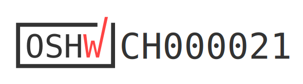

<!-- badges: start -->

<!-- badges: end -->

<h1> Design of an HDPE bottle collection and pre-cleaning system for recycling in Blantyre, Malawi </h1>

<b>Contributors</b>  
- Timo Stutz *author*  
- Elizabeth Tilley <a href="https://orcid.org/0000-0002-2095-9724">
 0000-0002-2095-9724
</a> *supervisor*  
- Lin Boynton <a href="https://orcid.org/0000-0002-9944-3834">
 0000-0002-9944-3834
</a> *supervisor*  
- Jakub Tkaczuk <a href="https://orcid.org/0000-0001-7997-9423">
 0000-0001-7997-9423
</a> *supervisor, developer, maintainer*  
- Nicolas Seemann-Ricard <a href="https://orcid.org/0000-0002-0945-7475">
 0000-0002-0945-7475
</a> *developer*  

 

 

  
This work is certified by the Open Source Hardware Association. 

 
<b>Complete description of the system design, its functionalities, and  is available on: 
<a href="https://global-health-engineering.github.io/pre-cleaning-system-design-for-HDPE-bottles/">Github pages</a>.
</b>
  
It compliments the openly-accessible master’s thesis, available on the   
<a href="https://doi.org/10.3929/ethz-b-000658745">ETH Research Collection</a>.
  
The pdf version of this repository is available in the <code>report</code> directory of this repo.

# Background

This repository contains an overview of a prototype for an HDPE bottle pre-cleaning station, developed as a sustainable solution to enhance recycling processes in low-resource settings. The prototype was developed within the master’s thesis of Timo Stutz, contributing to a PhD project conducted by Lin Boynton at the Chair of [Global Health Engineering](https://ghe.ethz.ch/) at [ETH Zurich](https://ethz.ch/en.html). The PhD research aims to design, implement, and evaluate a closed-loop plastic bottle recycling scheme in low-income countries to efficiently, and effectively manage the flow of waste bottles from consumers into new drinking bottles. The prototype addresses the challenges of recycling contaminated HDPE bottles by introducing an efficient, scalable, and locally adaptable pre-cleaning system aiming to reduce the efforts and costs of subsequent recycling processes. Designed and tested through a collaborative research project, this documentation summarizes the prototype's design, constructional and operational procedures, maintenance of the device, and safety recommendations.

# License

This work is licensed under
[Creative Commons Attribution 4.0 International](https://github.com/Global-Health-Engineering/pre-cleaning-system-design-for-HDPE-bottles/blob/main/LICENSE.md).
